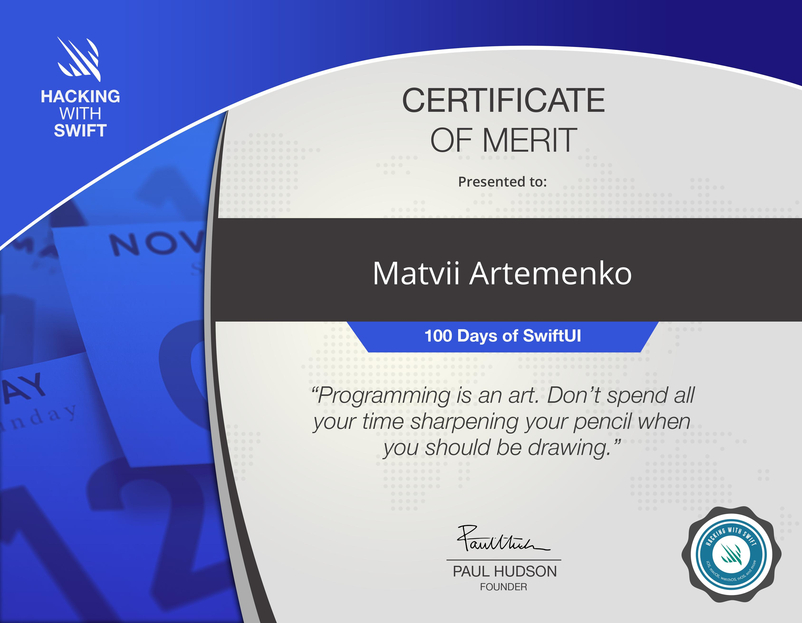

# 100 Days of SwiftUI Challenge

Autor of the challenge -  [Paul Hudson](https://www.hackingwithswift.com/about)
 
Twitter - [@twostraws](
https://twitter.com/twostraws)
 
About challenge - [100DaysOfSwiftUI](https://www.hackingwithswift.com/100/swiftui)
 
My projects - [Matvii Artemenko Github](https://github.com/orgs/100DaysOfSwiftUI-MatviiArtemenko/repositories)

***

## How it works❓
>Welcome to the 100 Days of SwiftUI! This is a free collection of videos, tutorials, tests, and more, all drawn from around my work here on Hacking with Swift, and all designed to help you learn SwiftUI effectively. It’s aimed squarely at beginners who want to learn to build real iOS apps, but struggle to find a good, free course that can help them achieve their goals. If that’s you, welcome – I hope you’re ready to show the iOS world what you’re made of!

***

## Rules
>If you want to make a success of this course, there are only two rules:
* Every day you spend one hour reading or watching SwiftUI tutorials, or writing SwiftUI code.
* Every day you post about your progress to the social media site of your choosing. Tell people!
>I’ll be providing all the material you need to follow along, so all you need to do is show up ready to learn. I’ve even provided a “Tweet” button at the end of every day, which composes a tweet for you saying you completed the day, and includes the hashtag to help others find you, a celebratory graphic, and a link for others to find out more – use it!

*** 

## My works 

You can find all of my wokrs from this challenge [here](https://github.com/orgs/100DaysOfSwiftUI-MatviiArtemenko/repositories)

## Final Exam 📄

>Today is the final day of the 100 Days of SwiftUI, which means you made it. You went through all 100 days of learning, watching videos, taking tests, completing challenges, and writing code, and you made it to the end.
Even though we’ve probably never met, I feel proud of you. Nothing about this challenge was easy: I made you study every day, I pushed you to answer well over a thousand questions about Swift and iOS, and I gave you difficult challenges to complete.

## Certificate
